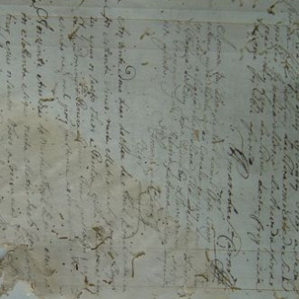
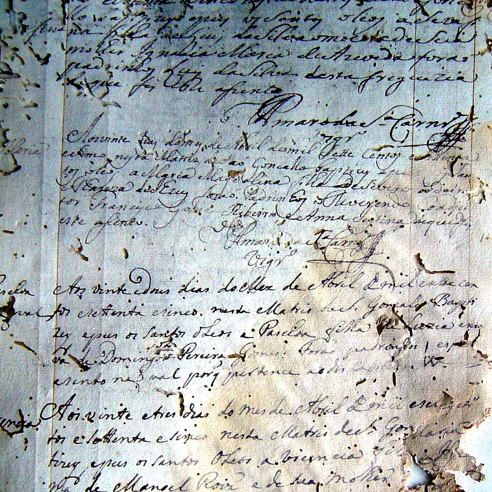

# scrape-slavery-books
This is an effort to download full-resolution imagery from some of Vanderbilt's Slave Societies Digital Archive
and develop a different version of the files that's processed for readability. This will save the full-resolution version inside a "raw" folder with your book name
inside a "books" folder. It will also create a "processed" folder with images rotated into portrait mode as needed, with some efforts to sharpen images and
add contrast. The specifics of sharpening and contrast can be tweaked to your desire.

This has been tested with exactly one book, at https://essss.library.vanderbilt.edu/islandora/object/essss%3A38558#page/15/mode/1up.

This project was developed after seeing someone flipping a laptop screen around and trying to peer at a contrastless mess of an image.

 became

